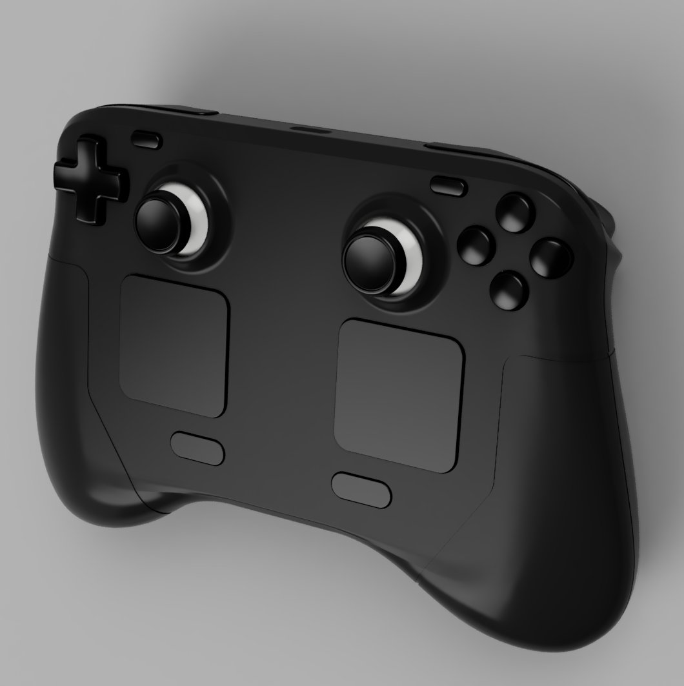

# SteamPad: A SteamDeck inspired gamepad!

Convert your spare Steam Deck parts into a fully functional standalone controller! This project aims to repurpose original Steam Deck components into a custom-designed handheld controller.

For the time being, this controller is wired only. A full wireless solution may come at some point in the future!

## 🎯 Project Goals

- Create a standalone controller using original Steam Deck (LCD-Deck) parts
- Design and provide 3D printable shell (hopefully compatible with resin / FDM printers)
- Provide possibility for a basic wired-only controller build

## ✅ Current Progress

- [x] USB pinout reverse engineering completed ([details](./research/Controller_Boards.md))
- [x] Basic wired proof-of-concept showing the possibility ([demo video](https://youtu.be/daWLg8Y8ThU))
- [x] Design FFC to USB-C Breakout PCB
  - For development purposes
  - [Optional] for wired-only controller builds
- [x] Design 3D printable shell prototype (_Resin / FDM / SLS is TDB_)
- [ ] Create detailed assembly guide
- [ ] TBD

### 🤔 Why this approach?

- **Driver-Free Operation**: The USB dongle will emulate the original USB descriptors, allowing the controller to work without additional drivers.
- **No Additional Software**: The controller will work out-of-the-box via Steam.
- **No Firmware Modification**: The controller will work with the original Steam Deck firmware.

## 🛠️ Getting Started

[Coming Soon]

## 📋 Requirements

- Original Steam Deck controller parts (specific list coming soon)
- [Additional requirements TBD]

## 🤝 Contributing

Contributions are welcome! Please feel free to submit a Pull Request.

### 💬 Discord

Join our Discord server to discuss the project, ask questions, or share your ideas!  

## 📝 License

This project is licensed under the MIT License - see the [LICENSE](LICENSE) file for details.

## 🙏 Acknowledgments

- Steam Deck Controller Team
  - [Roni1993](https://github.com/Roni1993)
  - [Alia5](https://github.com/Alia5)
  - [oaSysFox](https://github.com/oaSysFox)
  - [Additional Members here]
- [Valve Corporation](https://www.valvesoftware.com/) - For creating the Steam Deck, the original Steam Controller and Steam Input
- [SlickBuys](slickbuysmodsandrepairs.com/) - For providing parts

## ⚠️ Disclaimer

This is a community project not affiliated with Valve Corporation. Use at your own risk.