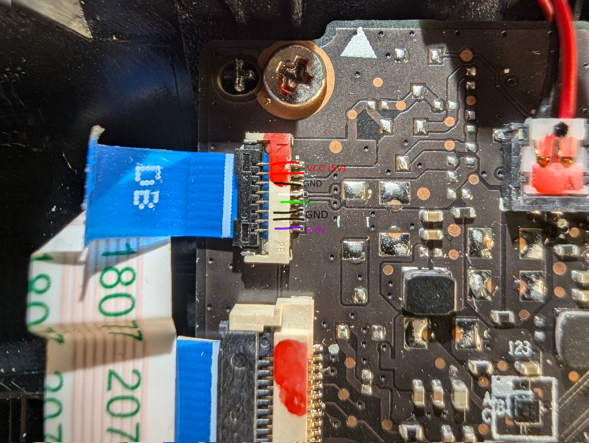

# Controller Boards

The Steam Deck controller consists of multiple boards.  
The two "main" boards are connected via a 16 pin flexible flat cable (FFC) with a 0.5mm pitch. (Protocol currently unknown)

## Right hand controller board

The right hand controller board is the primary "main"-board of the controller.
It manages the USB 2.0 communication with the Decks mainboard via an 8 pin FFC with a 0.5mm pitch.

The purpose of the 3.3V pin is currently unknown, but can be left floating as it is seemingly not needed for the USB connection.

## Demo / PoC showing USB 2.0 connection to a regular Windows PC

